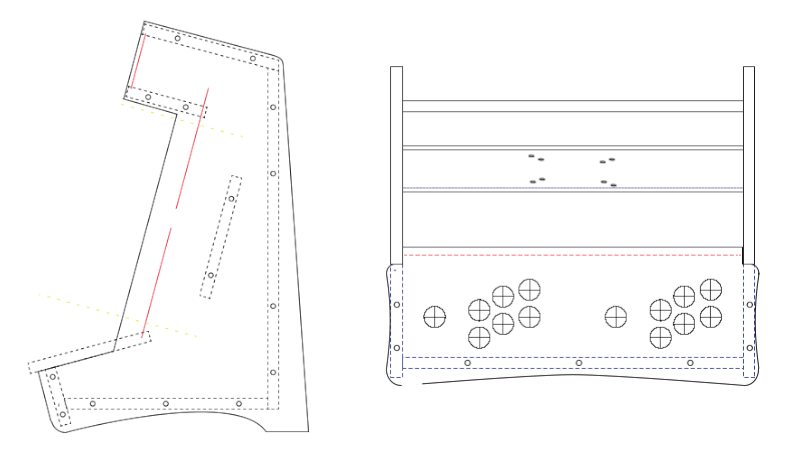
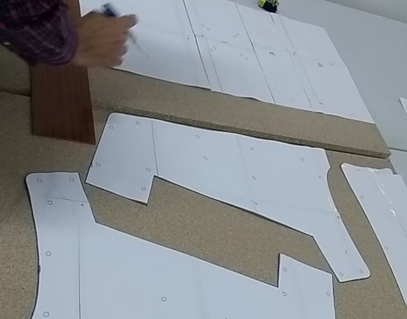
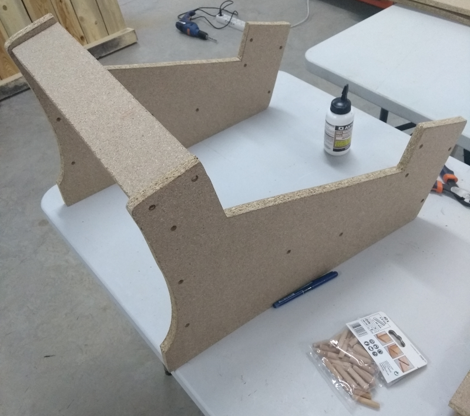
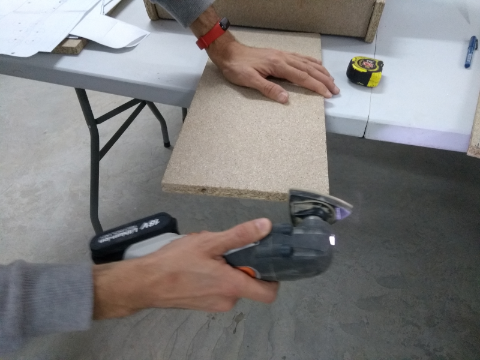
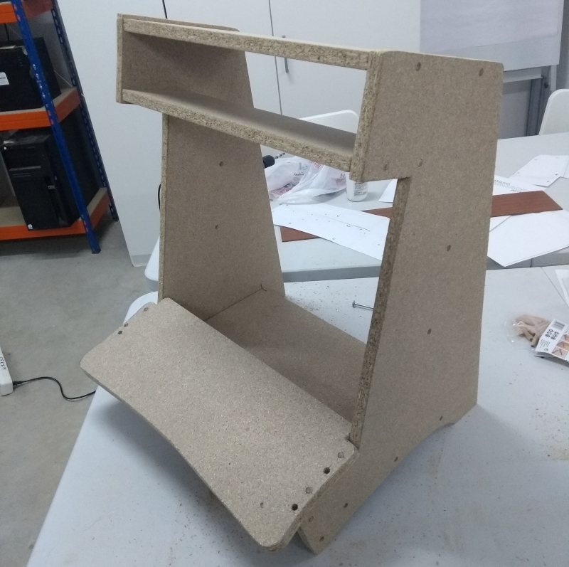
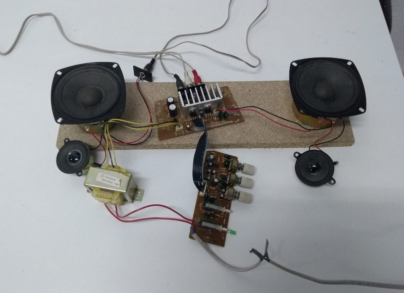
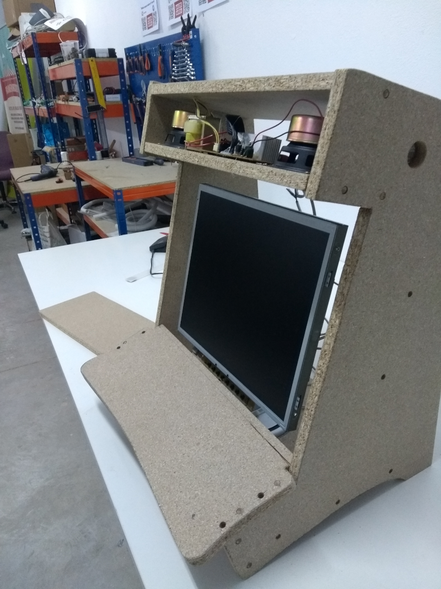
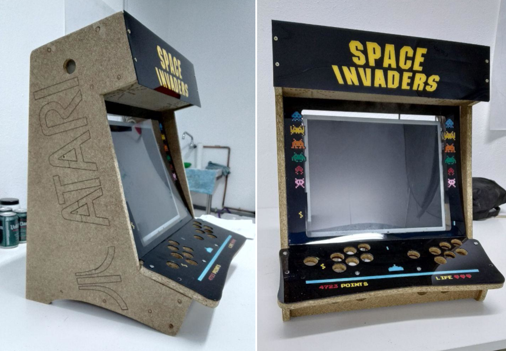

# Máquina recreativa arcade DIY

> En construcción

- [Máquina recreativa arcade DIY](#m%C3%A1quina-recreativa-arcade-diy)
  - [Planos](#planos)
  - [Construcción](#construcci%C3%B3n)
  - [Montaje](#montaje)
  - [Mecánica](#mec%C3%A1nica)
  - [Metacrilatos](#metacrilatos)
  - [Electrónica](#electr%C3%B3nica)
  - [Retropie](#retropie)
- [License](#license)

## Planos

Tomando los [planos](src/planos.pdf) realizados por Antonio, se imprieron en formato A4 y se juntaron al no disponer de un plotter de impresión. Una vez obtenidos los patrones, se fijaron sobre la madera aglomerada y se marcaron.

## Construcción

Para el corte de las maderas se utilizó una sierra de calar. Una vez cortadas todas las piezas se limaron los cantos con una lija de grano fino.

## Montaje

Siguiendo el plano, se realizaron los agujeros sobre cada una de las piezas y se unieron utilizando espigas de madera.

> Los agujeros de las posiciones de los mandos no se corresponden perfectamente y hay que modificar el diseño.

Todas las piezas han sido limadas de forma momentanea ya que el objetivo es crear cantos redondeados.

En este paso se decidió no encolar todavía las piezas hasta no disponer de las piezas mecánicas como los botones para poder maniobrar mejor en la construcción.

## Mecánica

Al estar utilizando materiales reciclados en todo momento, hemos elegido unos altavoces que todavía funcionaban para desmontarlos y añadirlos a la base.

El monitor se ha acoplado a la base mediante bridas sujetadas en el soporte del monitor sin carcasa.

## Metacrilatos

Se ha utilizado vinilos sobre el metacrilato y la madera de los laterales.

## Electrónica

ToDo

## Retropie

ToDo

---

# License

- Makers Of Murcia
- Migue
- Antonio

